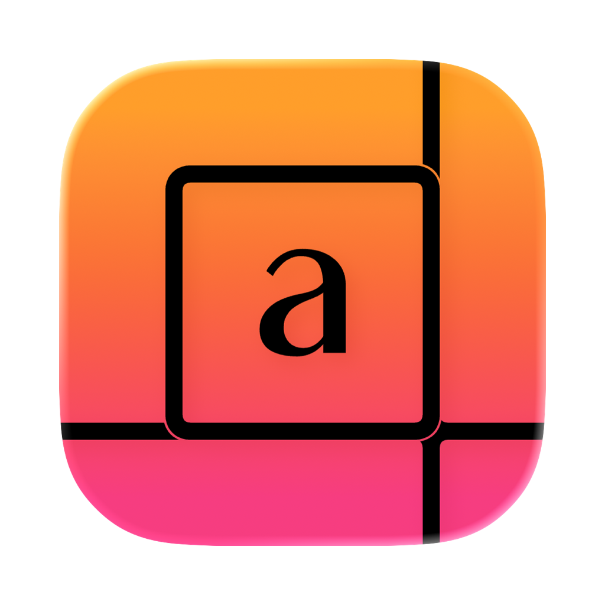
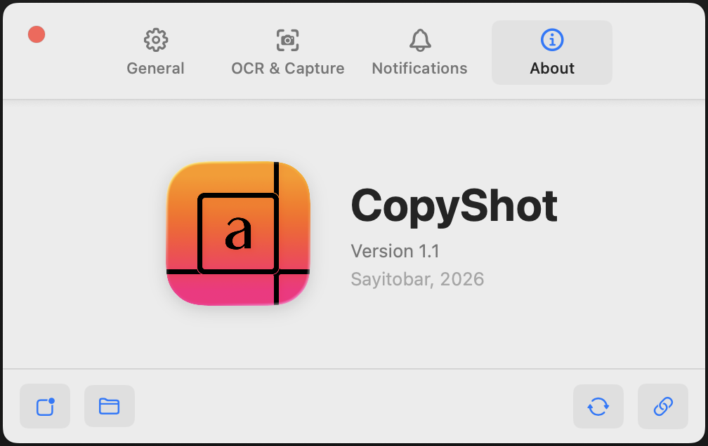

<div align="center" style="display: flex; justify-content: center; align-items: center; margin-bottom: 20px;">
  
  <div style="text-align: left;">
    <h1 align="center" style="margin: 0;">CopyShot</h1>
    <p align="center" style="margin: 0; color: gray;">Fast OCR in your Mac's menu bar</p>
  </div>
</div>

<div align="center">
<a href="https://github.com/Sayitobar/CopyShot/releases"></a>
<a href="https://github.com/Sayitobar/CopyShot/releases"></a>
<a href="https://github.com/Sayitobar/CopyShot/blob/master/LICENSE"></a>
<a href="https://github.com/Sayitobar/CopyShot"></a>
</div>

<br/>
<br/>

<p align="center">
  Select → extract → clipboard. One keystroke (⌘⇧C).<br>
  Works on every display, resource friendly, and it’s open source.
</p>

<br/>
<div align="center">
  <br/>
</div>

<hr>

## Main Features

| Feature | Description |
|---------|-------------|
| **Drag-to-Capture** | Any screen area, instantly. |
| **Multi-Monitor** | Seamless across all displays. |
| **⌘⇧C (or your own)** | Re-bindable global hotkey. |
| **Vision OCR** | Accurate & Fast modes, with language correction option. |
| **Image Preprocessing** | Grayscale and contrast adjustments for better results. |
| **Settings Interface** | Built with SwiftUI for a smooth, native feel. |
| **Notifications** | Includes sound, haptics, icons, and a preview you can tweak. |
| **Resource Friendly** | Uses minimal CPU and RAM. It's also very small in size. |

---

## Privacy
CopyShot respects your privacy. All OCR processing happens locally on your device using Apple's Vision framework. The app **does not have internet access** and **does not access any of your personal files**. Your captured images and extracted text remain entirely on your Mac.

---

## Installation

> **Note:** CopyShot requires **macOS 14 (Sonoma)** or later.

1. **Download the App:**
   Go to the [Releases](https://github.com/Sayitobar/CopyShot/releases) page and download the latest version of `CopyShot`.

2. **Open the App:**
   - Because CopyShot is an open-source tool and not distributed through the Mac App Store, macOS Gatekeeper will block it when tried to open with a message saying *"CopyShot Not Opened, Apple could not verify CopyShot is free of malware that may harm your Mac or compromise your privacy."*.
   - **To bypass this:** Go to `System Settings > Privacy & Security`, scroll down to the bottom, and click **Open Anyway** where it mentions CopyShot was blocked. You only need to do this once.

3. **Grant Screen Recording Permission:**
   - The first time you use CopyShot (by pressing the hotkey), macOS will block it from capturing your screen.
   - Go to `System Settings > Privacy & Security > Screen & System Audio Recording`.
   - Find **CopyShot** in the list and **enable the toggle**.
   - **Important:** After granting permission, **Quit and Reopen** CopyShot for the changes to take effect.


## Running from source (for developers)
<details>
  <summary>Click to expand</summary>

If you'd like to edit, build and run CopyShot yourself on macOS, here's how to get started.

### Prerequisites
- macOS 14+
- Xcode (free from the App Store)

### Steps
1. **Clone the Repo:**
   Open Terminal and run:
   ```
   git clone https://github.com/Sayitobar/CopyShot.git
   cd CopyShot
   ```

2. **Open in Xcode:**
   Double-click `CopyShot.xcodeproj` to open it in Xcode.

3. **Build and Run:**
   In Xcode, select the `CopyShot` target and your desired build scheme (e.g., `My Mac`).
   Hit the **Run** button (play icon) or go to `Product > Run`.
   It should build and launch the app.

4. **Grant Permissions:**
   The first time you run CopyShot, macOS security features will prevent it from capturing your screen. You will need to manually grant permission. Here is how to locate `Screen Recording Permissions` manually:
   - Go to `System Settings > Privacy & Security > Screen Recording`.
   - Find **CopyShot** in the list of applications and **enable the toggle** next to it.
   - Quit and reopen CopyShot for the changes to take effect.

5. **Making Code Changes:**
   If you'd like to make any change to the code:
   - Save your changes.
   - Quit any running CopyShot instances.
   - Delete te given `Screen Recording Permission` access to all CopyShot instances.
   - Rerun the app and regrant permissions. (If doesn't work, try `Product > Perform Action > Run Without Building`)

Once it's set up, CopyShot should run & appear in your menu bar. If you're going through all this, thanks for checking it out, you probably know your way around, so feel free to tweak it.

</details>


## Ideas for future features (suggestions welcome)

<details>
  <summary>Click to expand</summary>

### Editing Copied Texts
- Introduce a button below the copy notification to apply various text edit tools for quick edits, like removing line breaks, applying UPPERCASE, lowercase, Title Case, Sentence case, tOGGLE, etc.
- Possibly integrate an LLM (or a more powerful OCR like DeepSeek-OCR) with your API key and a custom system prompt for editing the text.

### OCR Improvements
- Personal glossary for domain-specific terms.
- Multi-language picker UI.
- OCR history with instant search & re-copy.
- Drag-and-drop image files into the app for OCR.
- Advanced preprocessing: deskew, denoise, adaptive binarization...

### Capture Options
- Capture an entire window or app
- Countdown timer for captures.
- Handle scrolling areas for long pages.
- Option to save captures as images (PNG/JPG).
- Option to copy the image itself to the clipboard.

### Usability and Accessibility
- Onboarding guide for first-time users.
- Built-in help tips.
- VoiceOver & other accessibility refinements.

</details>

## About the Project

CopyShot v1.0.0 was **live-coded with Gemini CLI**: Every line, refactor, and bug-fix was done with the help of Gemini.
This small experiment shows how far AI-assisted software development has come.

## License
This project is licensed under the MIT License - see the [LICENSE](LICENSE) file for details.
